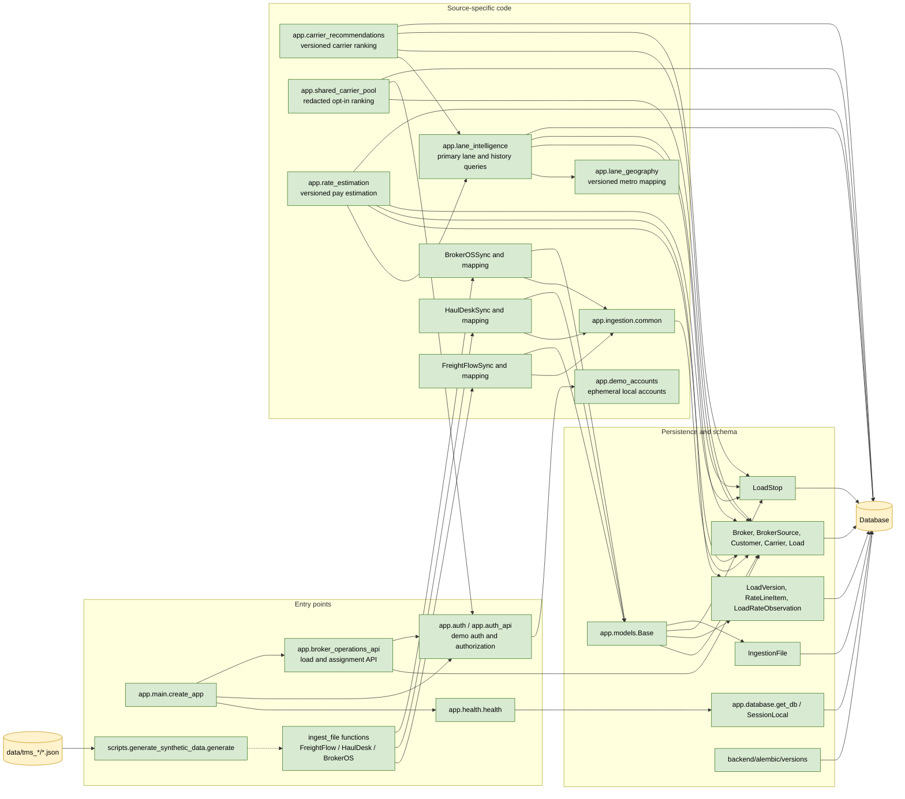

# C4: Code-Level Responsibilities

**Status: Delivered baseline with guarded shared-pool backend and demo auth**

This is a code-level map of the most important symbols and package groups. It
is intentionally selective; it documents architectural ownership rather than
every class and helper.

## Key Code Contracts

- `create_app()` returns the configured FastAPI application.
- `health()` checks database connectivity and returns an HTTP 503 when the
  database is unavailable.
- Each adapter's `ingest_file(session, broker_source_id, path)` is the
  file-oriented integration boundary.
- `Base` and its mapped classes define canonical persistence and tenant
  constraints.
- `LoadVersion` preserves source and normalized snapshots.
- `RateLineItem` and `LoadRateObservation` preserve distinct additive-journal
  and replacement-observation semantics.
- `generate()` creates deterministic source fixtures without changing
  unrelated files.

## Deferred Code Areas

- Production identity-provider integration in place of the demo token issuer and
  ephemeral local-account layer.
