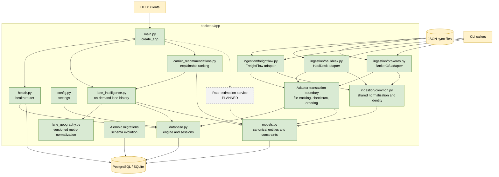

# C3: Backend Components

**Status: Delivered baseline with planned service components**

This view describes the current backend package boundaries. Planned components
are shown only to establish future ownership and integration points.

## Component Responsibilities

- `main.py` constructs the FastAPI application and registers routers.
- `health.py` exposes the synchronous database health check.
- `config.py` loads environment-backed settings.
- `database.py` owns the SQLAlchemy engine, session factory, and dependency.
- `models.py` defines canonical entities, enums, tenant constraints, and
  financial validation.
- The adapter transaction boundary records files, enforces checksums/order, and
  provides all-or-nothing persistence.
- `common.py` centralizes carrier identity normalization and shared upserts.
- Each TMS module owns source schema validation, source-specific mapping, and
  its CLI entry point.
- Alembic owns versioned schema changes and append-only database triggers.
- `lane_geography.py` owns the versioned bundled ZIP/city-to-metro mapping.
- `lane_intelligence.py` derives primary lanes and correction-safe history on
  demand from current broker-scoped canonical rows.
- `carrier_recommendations.py` aggregates logical broker-owned carriers, scores
  historical evidence, and returns deterministic explanations on demand.
- `recommendation_api.py` exposes the broker-scoped recommendation contract.

## Planned Integration Points

- Recommendation logic consumes canonical loads, stops, carriers, and the
  delivered lane-intelligence history contract.
- Rate estimation will consume canonical rate history and lane dimensions.
- Both services must be broker-scoped and expose explanation metadata.
