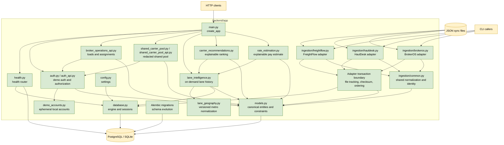

# C3: Backend Components

**Status: Delivered backend components for the API, demo auth, operations, and shared pool**

This view describes the current backend package boundaries. Production identity
provider integration remains a future boundary rather than a runtime component.

## Component Responsibilities

- `main.py` constructs the FastAPI application and registers routers.
- `health.py` exposes the synchronous database health check.
- `auth.py` verifies demo bearer tokens and enforces broker/admin scope.
- `auth_api.py` exposes demo broker discovery, login, account, and profile
  endpoints; `demo_accounts.py` keeps local account state in process memory.
- `broker_operations_api.py` exposes broker-scoped load, carrier, and assignment
  contracts.
- `shared_carrier_pool.py` and `shared_carrier_pool_api.py` compute and expose
  authenticated, redacted cross-broker recommendations and aggregate rates.
- `config.py` loads environment-backed settings.
- `database.py` owns the SQLAlchemy engine, session factory, and dependency.
- `models.py` defines canonical entities, enums, tenant constraints, and
  financial validation.
- The adapter transaction boundary records files, enforces checksums/order, and
  provides all-or-nothing persistence.
- `common.py` centralizes carrier identity normalization and shared upserts.
- Each TMS module owns source schema validation, source-specific mapping, and
  its CLI entry point.
- Alembic owns versioned schema changes and append-only database triggers.
- `lane_geography.py` owns the versioned bundled ZIP/city-to-metro mapping.
- `lane_intelligence.py` derives primary lanes and correction-safe history on
  demand from current broker-scoped canonical rows.
- `carrier_recommendations.py` aggregates logical broker-owned carriers, scores
  historical evidence, and returns deterministic explanations on demand.
- `recommendation_api.py` exposes the broker-scoped recommendation contract.
- `rate_estimation.py` computes versioned, explainable all-in carrier-pay
  estimates from canonical completed-load history.
- `rate_estimation_api.py` exposes the broker-scoped rate-estimation contract.

## Integration Points

- Recommendation logic consumes canonical loads, stops, carriers, and the
  delivered lane-intelligence history contract.
- Rate estimation consumes canonical rate history and lane dimensions.
- Both services must be broker-scoped and expose explanation metadata.
- The operations and shared-pool routers use the same authenticated principal
  boundary; production identity-provider integration replaces only the demo
  issuer and account layer.
