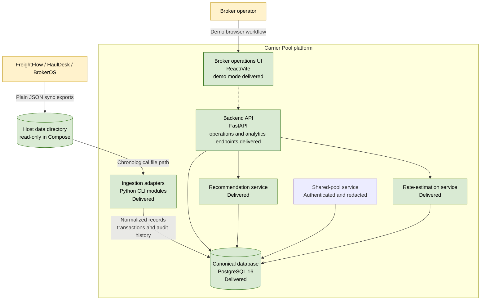

# C2: Containers

**Status: Delivered baseline with authenticated shared-pool workflow**

Containers are logical runtime or deployment units. The current system has a
FastAPI foundation, a React/Vite operations console, and CLI ingestion modules
rather than a background ingestion service.

## Container Responsibilities

| Container | Responsibility | Status |
|---|---|---|
| Backend API | FastAPI health, lane intelligence, recommendation, and rate-estimation endpoints | Delivered |
| Ingestion adapters | Validate, normalize, and transactionally ingest one file | Delivered |
| Canonical database | Tenant-scoped state, versions, journals, and observations | Delivered |
| Sync-file directory | Immutable input boundary for downloaded exports | Delivered |
| Operations UI | Lifecycle load queue, detail workspace, analytics, and demo assignment overlay | Delivered (demo mode) |
| Recommendation service | Explainable broker-scoped carrier ranking | Delivered |
| Shared-pool service | Opt-in, redacted cross-broker carrier ranking/rates and query audit | Delivered (demo auth) |
| Rate-estimation service | Explainable broker-scoped expected carrier pay | Delivered |

## Deployment Notes

- Docker Compose runs PostgreSQL, the backend, and the React/Vite console.
- The demo backend container runs Alembic migrations and bootstraps sync files
  before Uvicorn. Production runs migrations in a separate one-off job and the
  API process only starts after that job succeeds.
- The `data/` directory is mounted read-only at `/data`.
- The default test suite uses SQLite; PostgreSQL is the deployment database.
- Shared-pool reads are disabled by default. Enabling them requires an opaque-ID
  secret and broker bearer authentication. Demo Compose uses a signed mock token
  issuer; production uses the configured OIDC/JWKS identity provider and
  verified tenant claim.
