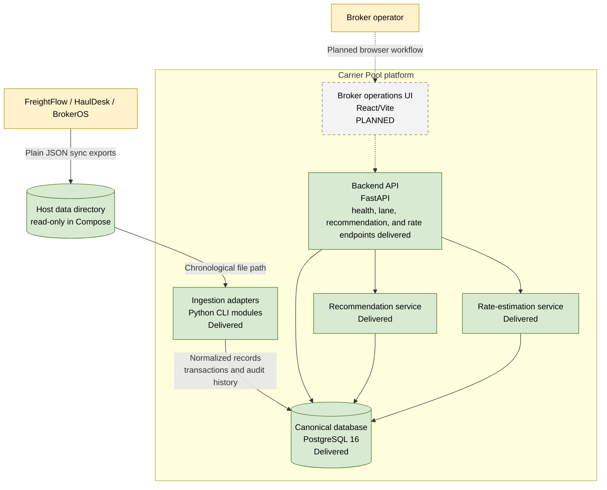

# C2: Containers

**Status: Delivered baseline with planned containers**

Containers are logical runtime or deployment units. The current system has a
FastAPI foundation with lane and recommendation APIs plus CLI ingestion modules
rather than a background ingestion service.

## Container Responsibilities

| Container | Responsibility | Status |
|---|---|---|
| Backend API | FastAPI health, lane intelligence, recommendation, and rate-estimation endpoints | Delivered |
| Ingestion adapters | Validate, normalize, and transactionally ingest one file | Delivered |
| Canonical database | Tenant-scoped state, versions, journals, and observations | Delivered |
| Sync-file directory | Immutable input boundary for downloaded exports | Delivered |
| Operations UI | Load list and recommendation workflow | Planned |
| Recommendation service | Explainable broker-scoped carrier ranking | Delivered |
| Rate-estimation service | Explainable broker-scoped expected carrier pay | Delivered |

## Deployment Notes

- Docker Compose runs PostgreSQL and the backend.
- The backend container runs Alembic migrations before Uvicorn.
- The `data/` directory is mounted read-only at `/data`.
- The default test suite uses SQLite; PostgreSQL is the deployment database.
