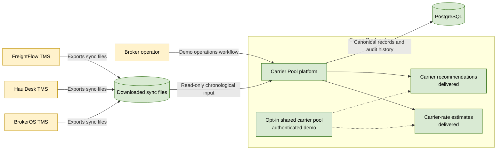

# C1: System Context

**Status: Delivered baseline with demo operations UI and authenticated shared-pool path**

Carrier Pool ingests broker-owned TMS exports into a canonical, tenant-scoped
data model. The current implementation provides ingestion, lane intelligence,
carrier recommendations, carrier rate estimates, a demo-mode broker operations
workflow, an authenticated shared-pool path, a production OIDC/JWKS deployment
boundary, and a durable ingestion worker. The hardening milestones are delivered;
durable local account storage and large-dataset benchmarking remain deferred.

## Relationships

- TMSs export files; Carrier Pool does not call TMS APIs.
- Sync files are read-only inputs and are processed one file at a time.
- PostgreSQL stores canonical broker-scoped records and ingestion history.
- Recommendations and estimates use broker-owned history by default.
- The shared pool is the only cross-broker exception and requires explicit
  opt-in, authenticated access, and data-minimization rules.
